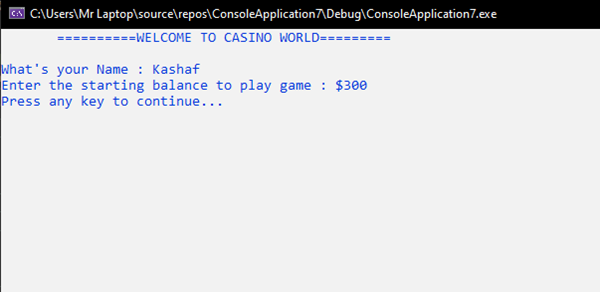
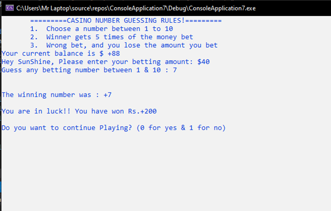
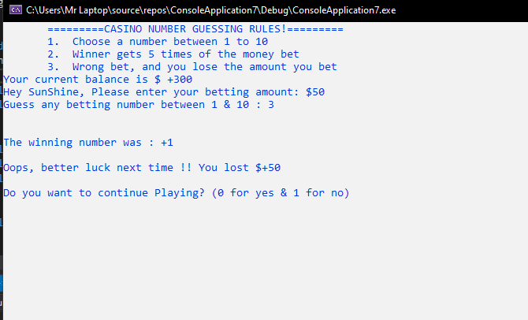

# CasinoNumberGeneratorCOAL
This is a small beginners project using Computer Organization and Assembly Language (COAL) using Irvine32.inc Library. 

A casino Numbering Game is a game in which you can make a bet on the amount of your choice on a number. 

It first asks for your name and the total amount you have.

On pressing ENTER, it displays some rules for you to understand how the game works. 
Rules are as follow:
1. Choose a number between 1 to 10
2. Winner gets 5 times of the money bet
3. Wrong bet and you lose the amount you bet

It displays the total amount and asks you to enter the amount you want to make bet on. 
If the amount is within range of the total amount then it asks you to choose the number you want to 
put money on. 
If the number is equal to the randomly generated number, you win 5 times the money you bet on. 

Else you end up losing the money

It asks you if you want to continue the game. If you say ‘0’ which means ‘yes’ then it goes again to ask you the 
amount you want to bet again. It goes on until either the user chooses ‘1’ which means ‘no’ he does not wish to continue the 
game or either he has zero money in his account. Either time it displays "Thanks for playing the game. Your Balance is:” and 
displays the remaining amount.
